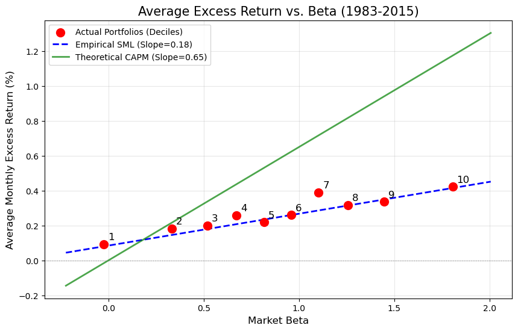

# Empirical CAPM Tests with Rolling Beta Portfolios

Empirical asset pricing project testing the Capital Asset Pricing Model (CAPM) using rolling beta estimation, portfolio sorting, and cross-sectional return analysis on U.S. equity data.

**Keywords:** CAPM, Fama–MacBeth regression, rolling beta, asset pricing, portfolio sorting, GRS test, low beta anomaly, empirical finance

---



---

## 1. Project Overview

This project empirically evaluates whether the Capital Asset Pricing Model (CAPM) adequately explains the cross-section of U.S. stock returns.

Using monthly stock return data from 1980–2015, firms are sorted into beta-decile portfolios based on rolling CAPM beta estimates. The project then performs both time-series and cross-sectional asset pricing tests to evaluate the empirical relationship between market beta and expected returns.

The analysis additionally investigates the persistence of the Low Beta Anomaly and the robustness of CAPM across different market periods.

---

## 2. Data and Portfolio Construction

The dataset contains monthly return observations for U.S. equities over the period:

- 1980–2015

The empirical workflow consists of:

- Constructing excess stock and market returns
- Estimating rolling 36-month CAPM betas
- Sorting firms into beta-decile portfolios each month
- Computing equal-weighted portfolio excess returns

A stock enters the portfolio sort only if sufficient return observations are available within the rolling estimation window.


**Table 0. Descriptive Statistics of Monthly Returns**
| Variable | Observations | Mean (%) | Std Dev (%) | Min (%) | Max (%) |
| -------- | ------------ | -------- | ----------- | -------- | ------- |
| $r_i$ | 388,103 | 0.6027 | 8.5622 | -13.1996 | 16.3325 |
| $r_m$ | 388,103 | 0.9427 | 3.3638 | -4.5746 | 6.7281 |
| $r_f$ | 388,103 | 0.3561 | 0.2784 | 0.0008 | 1.3583 |

---

## 3. Time-Series CAPM Tests

For each beta-sorted portfolio, the following time-series CAPM regression was estimated:

$$
R^e_{p,t} = \alpha_p + \beta_p R^e_{m,t} + \epsilon_{p,t}
$$

The analysis reports:

- Jensen’s alpha estimates
- Market beta estimates
- $R^2$
- Newey–West adjusted t-statistics

To jointly evaluate whether all pricing errors are zero, the Gibbons–Ross–Shanken (GRS) test was additionally conducted.

The empirical results show that several portfolios exhibit statistically significant non-zero alphas, suggesting that CAPM fails to fully explain expected returns across portfolios.


**Table 1. Time-Series Regressions of 10 Beta-Sorted Portfolios**

  
| Portfolio | $α$ | $t$-stat($α$) | $β$ | $t$-stat($β$) | $R^2$ |
| --------- | -------- | ------------------ | ------- | ----------------- | ------- |
| 1 | 0.0997 | 0.6783 | -0.0030 | -0.0627 | 0.0000 |
| 2 | -0.0304 | -0.2256 | 0.3340 | 7.3354 | 0.2220 |
| 3 | -0.1189 | -0.8741 | 0.5017 | 11.7289 | 0.3976 |
| 4 | -0.1639 | -1.2794 | 0.6550 | 14.4791 | 0.5310 |
| 5 | -0.2935 | -2.2785 | 0.7973 | 17.5060 | 0.6227 |
| 6 | -0.3251 | -2.3656 | 0.9116 | 19.6646 | 0.6648 |
| 7 | -0.2813 | -2.1017 | 1.0432 | 22.2202 | 0.7124 |
| 8 | -0.4697 | -3.5044 | 1.2311 | 26.2486 | 0.7725 |
| 9 | -0.5432 | -4.0417 | 1.3756 | 31.4382 | 0.8066 |
| 10 | -0.6781 | -4.6546 | 1.7167 | 42.6879 | 0.8398 |

  

**GRS Test Statistic & p-value**

  

| | Value |
| :--- | :---: |
| GRS Statistic | 4.7972 |
| \(p\)-value | 0.0000 |

---

## 4. Cross-Sectional Asset Pricing Tests

The project further applies the Fama–MacBeth two-pass regression framework to test whether higher-beta portfolios earn higher average returns.

Cross-sectional regressions were estimated using lagged rolling beta estimates:

$$
R^e_{p,t} = \gamma_{0,t} + \gamma_{1,t}\hat{\beta}_{p,t-1} + \eta_{p,t}
$$

The analysis evaluates:

- The empirical Security Market Line (SML)
- The estimated market risk premium
- The relationship between beta and realized portfolio returns

The empirical SML appears substantially flatter than the theoretical CAPM prediction, indicating weak pricing power of market beta.


**Table 2. Fama-MacBeth Regression Results**


| Coefficient | Mean | $t$-stat |
| ----------------------- | ------ | -------- |
| $\gamma_0$ (Constant) | 0.0851 | 0.7791 |
| $\gamma_1$ (Slope) | 0.1828 | 1.0019 |


---

## 5. Sub-sample Stability Analysis

To evaluate temporal stability, the sample was divided into two sub-periods:

- Era I: 1983–1999
- Era II: 2000–2015

The project compares:

- Portfolio alpha patterns
- Estimated beta-return relationships
- Cross-sectional slope coefficients
- Persistence of the Low Beta Anomaly

The results suggest that the weak empirical performance of CAPM persists across both sub-periods and becomes more pronounced during the later sample period.


**Table 3. Sub-sample Comparison (Era I vs Era II)**

  
| Portfolio | Era I Alpha (%) | Era II Alpha (%) |
| -------------------- | --------------- | ---------------- |
| 1 | -0.1262 | 0.3657 |
| 2 | -0.3479 | 0.3148 |
| 3 | -0.4597 | 0.2588 |
| 4 | -0.5009 | 0.2142 |
| 5 | -0.6276 | 0.0819 |
| 6 | -0.6183 | 0.0077 |
| 7 | -0.5634 | 0.0495 |
| 8 | -0.7743 | -0.1128 |
| 9 | -0.8266 | -0.2116 |
| 10 | -0.8488 | -0.4459 |
| $γ1$ (Slope) | 0.3842 | 0.0241 |
| $t$-stat (Slope) | 1.5378 | 0.0919 |


## 6. Key Findings

- CAPM fails to fully explain cross-sectional returns

- High-beta portfolios underperformed expectations

- Empirical Security Market Line (SML) is significantly flatter than the theoretical CAPM prediction

- The Gibbons–Ross–Shanken (GRS) test strongly rejects the joint zero-alpha hypothesis

- The Low Beta Anomaly persists across different market sub-periods

---

## 7. Repository Structure

```plaintext
empirical-capm-tests/
│
├── notebooks/
│   └── empirical_capm_analysis.ipynb
│
├── figures/
│   └── security_market_line.png
│
│
├── data/
│   └── USstocks.csv
│
└── README.md
```

---

## 8. Tools and Libraries

The project was implemented using:

- Python
- pandas
- NumPy
- statsmodels
- SciPy
- matplotlib
- Jupyter Notebook

---

## 9. Korean Summary (한국어 요약)

이 프로젝트는 미국 주식 데이터를 활용하여  
CAPM(Capital Asset Pricing Model)의 설명력을 실증적으로 검증한 프로젝트입니다.

Rolling beta를 기반으로 beta-decile portfolio를 구성하고,  
time-series CAPM regression 및 Fama–MacBeth cross-sectional 분석을 수행했습니다.

분석 결과, CAPM은 기대수익률을 충분히 설명하지 못했으며,  
Low Beta Anomaly와 flat Security Market Line 현상이 뚜렷하게 관찰되었습니다.
